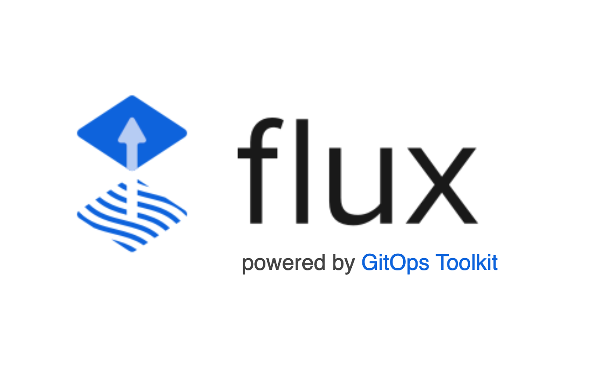
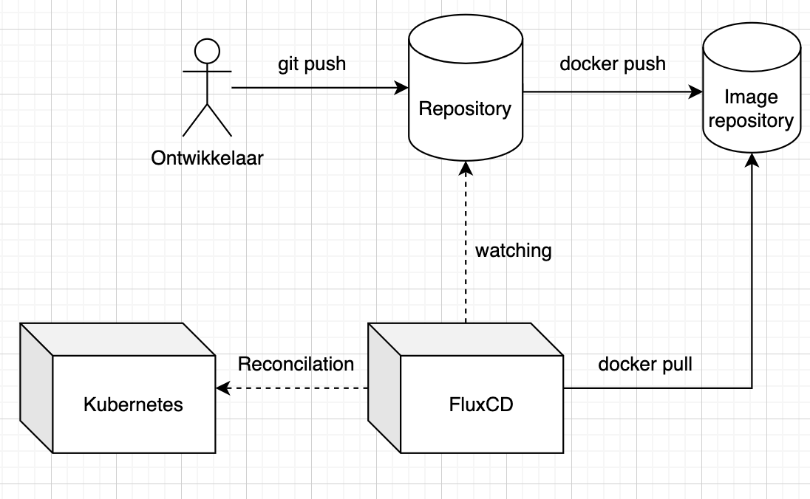

# Blijven deployen met FluxCD



FluxCD is een populaire tool om continuous delivery te implementeren en maakt gebruik van het GitOps-principe om de implementatie van applicaties in Kubernetes-omgevingen te automatiseren.

Als je in je applicatie gebruikmaakt van Kubernetes-clusters, moet je op het moment dat je een update wilt uitvoeren nog zelf veel stappen zetten om deze ook op productie te deployen. Aangezien je deze configuratiebestanden al in Git opslaat, is het nog maar een kleine stap om dit ook te automatiseren.

*[Bram Klapwijk, oktober 2024.](https://github.com/hanaim-devops/blog-student-naam)*

## Inhoudsopgave

1. [Bronnen](#bronnen)
2. [Conclusie](#conclusie)
3. [GitOps](#gitops)
4. [FluxCD](#fluxcd)
5. [Alternatieven](#alternatieven)
6. [Implementatie](#implementatie)
    1. [Flux installeren](#flux-installeren)
    2. [Flux configuratie schrijven](#flux-configuratie-schrijven)
    3. [CI pipeline bouwen](#ci-pipeline-bouwen)
7. [Conclusie](#conclusie)

## Bronnen

1. That DevOps Guy. (2023, 28 september). *Introduction to Flux CD on Kubernetes | GitOps | CICD* [Video]. YouTube. Geraadpleegd op 8 oktober 2024, van <https://www.youtube.com/watch?v=X5W_706-jSY>
2. OpenAI. (z.d.) *home*. ChatGPT.com. Geraadpleegd op 8 oktober 2024, van <https://chatgpt.com/>
3. FluxCD. (z.d.) *Get Started with Flux*. FluxCD.io. Geraadpleegd op 9 oktober 2024, van <https://fluxcd.io/flux/get-started/>
4. Courage Ihensekhien, O. (2024, 3 maart). *Argo CD vs. Flux CD: Choosing the Right GitOps Tool for Your Kubernetes Deployments*. Medium.com. Geraadpleegd op 8 oktober 2024, van <https://medium.com/@osascourage27/argo-cd-vs-flux-cd-choosing-the-right-gitops-tool-for-your-kubernetes-deployments-dbe93b598c69>
5. Gitlab. (z.d.) *What is GitOps?*. gitlab.com. Geraadpleegd op 9 oktober 2024, van <https://about.gitlab.com/topics/gitops/>

## GitOps

Flux is gebaseerd op het GitOps-principe. In GitOps is de Git-repository de enige bron van waarheid voor infrastructuur. In plaats van configuraties handmatig aan te passen op servers, automatiseert GitOps de implementatie en het beheer van infrastructuur via Git-repositories (Gilab, z.d.). Onderdeel van GitOps zijn bijvoorbeeld CI/CD-pipelines en infrastructure as code.

De essentiële onderdelen van een GitOps-werkwijze zijn:

Git-repository
CI-pipeline
Application Deployment Tool
Monitoring-systeem

## FluxCD

Hier komt FluxCD in het spel; het neemt de applicatiedeployment over binnen de GitOps-werkwijze. FluxCD kan de toestand van je Kubernetes-cluster automatisch synchroniseren met de configuratie die in een Git-repository staat. Als er wijzigingen in de repository worden aangebracht, worden deze automatisch naar het cluster gepusht.


Omdat de staat van de infrastructuur in Git wordt bewaard, kan er eenvoudig worden teruggedraaid naar een vorige versie.

## Alternatieven

Een van de bekendste alternatieven is ArgoCD. Het grootste verschil is dat ArgoCD een GUI meelevert en hier volledig op is georiënteerd (Courage Ihensekhien, 2024). Hierdoor is ArgoCD aanvankelijk makkelijker te gebruiken. FluxCD is echter uniek in zijn focus op GitOps en declaratieve configuratie, wat het een krachtige tool maakt voor teams die willen profiteren van de voordelen van automatisering en versiebeheer in Kubernetes. Terwijl andere CI/CD-tools ook waardevolle functionaliteit bieden, is FluxCD specifiek ontworpen om de uitdagingen van Kubernetes-omgevingen aan te pakken.

## Implementatie

Als voorbeeld gebruik ik een simpele Node-applicatie. Deze kan met Docker worden gebouwd en wordt in een Kubernetes-cluster gedraaid. De GitHub-repository voor de app die we willen deployen: [Demo app](https://github.com/BramKlapwijk/DemoApp).

De benodigde zaken om het stappenplan te volgen zijn:

- Kubernetes: Je hebt toegang nodig tot een werkend Kubernetes-cluster. Dit kan lokaal zijn (bijvoorbeeld via Minikube of Kind) of een extern cloudgebaseerd cluster (zoals EKS, GKE, of AKS).
- Git-repository: Een Git-repository (bijv. op GitHub, GitLab, etc.) waar je de configuratie- en applicatiebestanden beheert.
- Docker
In dit voorbeeld maken we gebruik van twee repositories, één voor de applicatie en één voor de configuratiebestanden. Dit is voor FluxCD preferabel, omdat FluxCD op deze manier maar één Git-repository in de gaten hoeft te houden, zelfs als er meerdere applicaties zijn. Daarnaast biedt dit de mogelijkheid om de rechten van de applicatie en de infrastructuur afzonderlijk te beheren.

### Flux installeren

Download FluxCD zoals in de [documentatie](https://fluxcd.io/flux/installation/#install-the-flux-cli) beschreven staat. Voer daarna het volgende commando uit:

```bash
flux bootstrap github
  --token-auth \
  --owner=my-github-username \
  --repository=my-repository-name \
  --branch=main \
  --path=clusters/my-cluster \
  --personal
```

Hiermee worden de basisbestanden gegenereerd om FluxCD in je Kubernetes-cluster te draaien.

### Flux configuratie schrijven

Als Flux geïnstalleerd is, kunnen we de configuratie schrijven waarmee FluxCD connectie maakt met de repository en het pad legt naar de configuratiebestanden van Kubernetes.

```yaml
apiVersion: source.toolkit.fluxcd.io/v1
kind: GitRepository
metadata:
  name: app-1
  namespace: default
spec:
  interval: 1m0s
  ref:
    branch: main
  url: https://github.com/BramKlapwijk/DemoAppInfrastructure
```

*gitrepository.yaml*

- url: bevat de URL van de Git-repository waar de Kubernetes-configuratiebestanden staan.
- branch: bevat de branch die gedeployed moet worden.

```yaml
apiVersion: kustomize.toolkit.fluxcd.io/v1
kind: Kustomization
metadata:
  name: app-1
  namespace: default
spec:
  interval: 15m
  path: "./k8s"
  prune: true
  sourceRef:
    kind: GitRepository
    name: app-1
```

*kustomization.yaml*

- prune: zorgt ervoor dat resources die niet langer in Git staan, worden verwijderd.
- path: geeft het pad aan waar je applicatie- of configuratiebestanden zich in de Git-repository bevinden.
- sourceRef: sourceRef: dit moet overeenkomen met de waarden in *gitrepository.yaml*.

```bash
kubectl -n default apply -f path-to-file/gitrepository.yaml
kubectl -n default apply -f path-to-file/kustomization.yaml

# Controleer onze flux resources 
kubectl -n default describe gitrepository app-1
kubectl -n default describe kustomization app-1

# Controleer deployed resources
kubectl get all
```

### CI pipeline bouwen

Als laatste stap moet FluxCD detecteren dat er een nieuwe update klaarstaat. Omdat de CI-pipeline buiten deze scope valt, gaan we er niet verder op in dan dat je via een script de image-property aanpast.

```yaml
...
spec:
      containers:
        - name: app-1
          image: app-1:0.0.1
          ports:
            - containerPort: 3000
```

*deployment.yaml*

Voor nu kunnen we de CI-pipeline nabootsen door eerst de image te bouwen en dan de *deployment.yaml* zelf aan te passen.

```bash
docker build . -t example-app-1:0.0.2
```

```yaml
...
spec:
      containers:
        - name: app-1
          image: app-1:0.0.2
          ports:
            - containerPort: 3000
```

*deployment.yaml*

Als het goed is, worden de updates nu automatisch gedeployed naar je Kubernetes-cluster.

De uitgewerkte code voor de configuratiebestanden staat in de volgende repository:[infrastructure](https://github.com/BramKlapwijk/DemoAppInfrastructure/tree/main)

## Conclusie

FluxCD biedt een krachtige en efficiënte oplossing voor het automatiseren van de deployment van applicaties in Kubernetes-omgevingen via het GitOps-principe. Door gebruik te maken van Git als de bron van waarheid, maakt FluxCD het eenvoudiger om applicatieconfiguraties consistent en betrouwbaar te beheren en updaten. Het vermindert de noodzaak voor handmatige acties, versnelt het releaseproces en verhoogt de veiligheid en controle door alles in versiebeheer te houden.

Met de juiste implementatie zorgt FluxCD ervoor dat je automatisch en continu kunt blijven deployen, wat leidt tot een stabielere en beter beheersbare infrastructuur.
