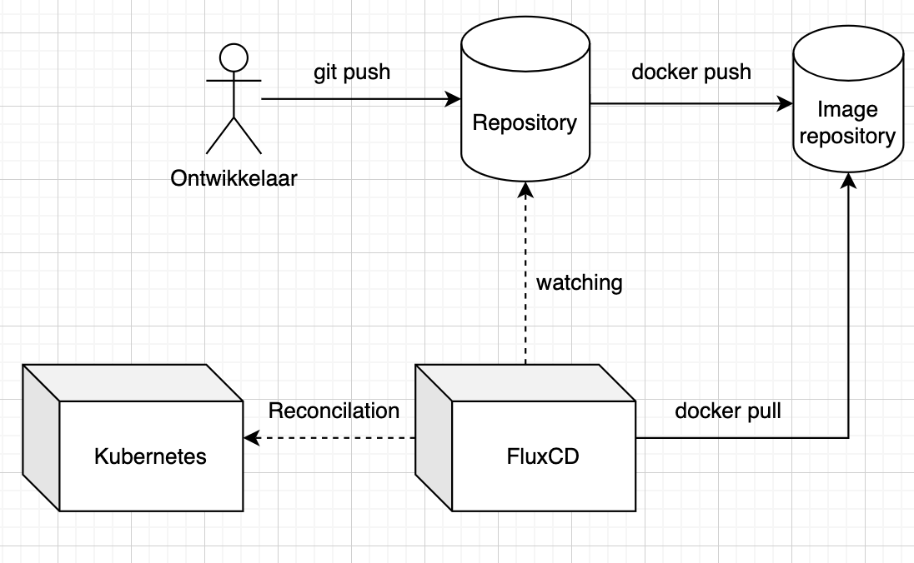
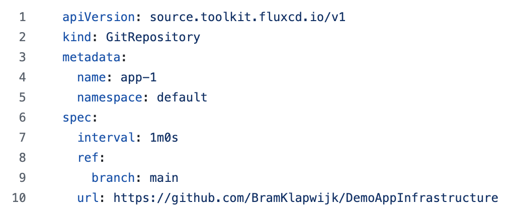
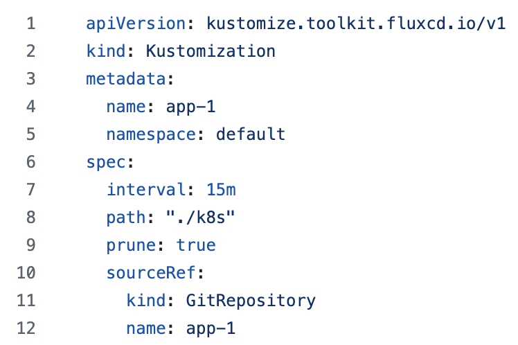

# Blijven deployen met FluxCD

*[Voornaam Achternaam, oktober 2024.](https://github.com/hanaim-devops/blog-student-naam)*

FluxCD is een populaire tool voor continuous delivery en maakt gebruik van het GitOps-principe om de implementatie van applicaties in Kubernetes-omgevingen te automatiseren.

Als je in je applicatie gebruik maakt van Kubernetes klusters moet je op het moment dat je een update wilt uitvoeren nog
zelf veel stappen maken om deze ook op productie te deployen. Aangezien je deze configuratie bestanden al in Git opslaat
is het nog maar een kleine stap om dit ook te automatiseren.

## GitOps

In GitOps is de Git repository de enkele bron van waarheid voor infrastructuur. In plaats van configuraties handmatig 
aan te passen op servers, automatiseert GitOps de implementatie en het beheer van infrastructuur via Git-repositories.
Onderdeel van Git OPS zijn bijvoorbeeld CI/CD pipelines en infrastructure as code.

De essentiele onderdelen van een GitOps werkwijze zijn:

1. Git repository
2. CD pipeline
3. Application Deployment Tool
4. Monitoring systeem

## FluxCD

Hier komt FluxCD in het spel, zij pakken de application deployment op van de GitOps werkwijze. FluxCD kan de toestand van je Kubernetes-cluster automatisch synchroniseren met de configuratie die in een Git-repository staat. Als er wijzigingen in de repository worden aangebracht, worden deze automatisch naar het cluster gepusht.



Omdat de staat van de infrastructuur in Git bewaard wordt kan er ook makkelijk weer teruggedraaid worden naar een vorige versie.

## Alternatieven

Een van de meest bekende alternatieven is ArgoCD. Het grootste verschil is dat ArgoCD een GUI meeleverd.
FluxCD is uniek in zijn focus op GitOps en declaratieve configuratie, wat het een krachtige tool maakt voor teams die willen profiteren van de voordelen van automatisering en versiebeheer in Kubernetes. Terwijl andere CI/CD-tools ook waardevolle functionaliteit bieden, is FluxCD specifiek ontworpen om de uitdagingen van Kubernetes-omgevingen aan te pakken.

## Implementatie


Als voorbeeld heb ik een simpele node applicatie. Deze kan door docker gebouwd worden en wordt in een kubernetes kluster gedraaid.

Verdere benodigdheden om het stappenplan te volgen zijn:

- Kubernetes: Je hebt toegang nodig tot een werkend Kubernetes-cluster. Dit kan lokaal zijn (bijvoorbeeld via Minikube of Kind) of een extern cloudgebaseerd cluster (zoals EKS, GKE, of AKS).
- Git-repository: Een Git-repository (bijv. op GitHub, GitLab, etc.) waar je de configuratie- en applicatiebestanden beheert.
- Docker

### Flux installeren

Download FluxCD zoals in de [documentatie](https://fluxcd.io/flux/installation/#install-the-flux-cli) beschreven staat. Voer daarna het volgende commando uit:

```bash
flux install
```

Hiermee worden de basis bestanden gegenereerd om FluxCD in je kubernetes cluster te draaien.

### Flux configuratie schrijven






## Bronnen

### Stappen om FluxCD te configureren en implementeren

### 1. **Installeer de Flux CLI**

De Flux CLI is nodig om Flux te installeren en te beheren in je Kubernetes-cluster.

```bash
bash
Copy code
brew install fluxcd/tap/flux
# of via curl als je brew niet gebruikt:
curl -s https://fluxcd.io/install.sh | sudo bash

```

Controleer of Flux correct is geïnstalleerd:

```bash
bash
Copy code
flux --version

```

### 2. **Koppel je Git-repository**

Je moet Flux toegang geven tot je Git-repository. Dit doe je door een koppelingssleutel te genereren en die aan Flux te verstrekken. Als je bijvoorbeeld GitHub gebruikt, kun je een SSH-sleutel aanmaken:

```bash
bash
Copy code
ssh-keygen -t rsa -b 4096 -C "flux"

```

- Voeg de publieke sleutel toe aan je Git-repository (bijv. op GitHub onder **Repository Settings > Deploy keys**).
- Houd de privésleutel veilig, omdat je deze straks nodig hebt om Flux toegang te geven tot de repository.

### 3. **Installeer Flux in Kubernetes**

Voer de volgende Flux-commando’s uit om FluxCD in je Kubernetes-cluster te installeren en te configureren. Dit gaat gepaard met het instellen van een repository en namespace.

```bash
flux install
```

Met dit commando worden de Flux-controllers in je Kubernetes-cluster geïnstalleerd, waaronder de **source-controller**, **kustomize-controller**, en **helm-controller** (indien je Helm gebruikt).

### 4. **Configureer Flux om met je Git-repository te synchroniseren**

Nu gaan we Flux configureren om je Git-repository te volgen en je applicaties of infrastructuurconfiguraties te beheren.

1. **Maak een `GitRepository` resource**. Dit vertelt Flux waar je Git-repository zich bevindt en hoe vaak hij deze moet controleren.

```yaml
yaml
Copy code
apiVersion: source.toolkit.fluxcd.io/v1beta1
kind: GitRepository
metadata:
  name: flux-system
  namespace: flux-system
spec:
  interval: 1m0s
  url: ssh://git@github.com/<your-username>/<your-repo>.git
  secretRef:
    name: flux-system

```

- De `url` verwijst naar je Git-repository.
- `interval` geeft aan hoe vaak Flux de repository controleert op nieuwe wijzigingen.
1. **Maak een `Kustomization` resource**. Dit zegt tegen Flux welke directory’s in je Git-repository moeten worden gebruikt om je applicaties of infrastructuur uit te rollen.

```yaml
yaml
Copy code
apiVersion: kustomize.toolkit.fluxcd.io/v1beta1
kind: Kustomization
metadata:
  name: apps
  namespace: flux-system
spec:
  interval: 1m
  path: "./path/to/your/app"
  prune: true
  sourceRef:
    kind: GitRepository
    name: flux-system
  targetNamespace: default

```

- De `path` geeft het pad aan waar je applicatie of configuratiebestanden zich in de Git-repository bevinden.
- `prune` zorgt ervoor dat resources die niet langer in Git staan, worden verwijderd.
- `targetNamespace` geeft aan in welke namespace de applicaties moeten worden uitgerold.

### 5. **Voeg de SSH-sleutel toe aan Flux**

Nu moet je de eerder gegenereerde SSH-sleutel toevoegen aan je Kubernetes-cluster zodat Flux toegang krijgt tot de Git-repository.

1. Converteer de privésleutel naar een Kubernetes Secret:

```bash
bash
Copy code
kubectl create secret generic flux-system \
  --namespace=flux-system \
  --from-file=identity=<path-to-your-private-key>

```

1. Verifieer of de secret correct is aangemaakt door het volgende te controleren:

```bash
bash
Copy code
kubectl get secrets -n flux-system

```

### 6. **Valideer en bekijk de synchronisatie**

Flux zal nu de Git-repository volgen en automatisch de configuratie uitrollen zoals gedefinieerd. Om de status van de synchronisatie te controleren:

```bash
bash
Copy code
flux get all

```

Dit toont de status van de resources die Flux beheert. Je kunt hier zien wanneer de laatste synchronisatie is uitgevoerd en of er fouten zijn opgetreden.

### 7. **Controleer de status van je resources in Kubernetes**

Gebruik `kubectl` om te controleren of je applicaties en configuraties succesvol zijn uitgerold:

```bash
bash
Copy code
kubectl get pods

```

Je zou nu de applicaties en infrastructuurresources in je Kubernetes-cluster moeten zien draaien, zoals gedefinieerd in je Git-repository.

### Optioneel: Helm-ondersteuning toevoegen

Als je Helm gebruikt om je applicaties te beheren, kun je de **Helm-controller** van Flux gebruiken. Eerst moet je een Helm-chart repository configureren:

```yaml
yaml
Copy code
apiVersion: source.toolkit.fluxcd.io/v1beta1
kind: HelmRepository
metadata:
  name: my-helm-repo
  namespace: flux-system
spec:
  interval: 1m
  url: https://charts.bitnami.com/bitnami

```

Daarna maak je een **HelmRelease** resource aan om een specifieke chart te deployen:

```yaml
yaml
Copy code
apiVersion: helm.toolkit.fluxcd.io/v2beta1
kind: HelmRelease
metadata:
  name: my-helm-release
  namespace: default
spec:
  chart:
    spec:
      chart: nginx
      version: "9.3.7"
      sourceRef:
        kind: HelmRepository
        name: my-helm-repo
        namespace: flux-system
  interval: 1m
  install:
    createNamespace: true

```

Met deze configuratie beheert Flux de Helm-charts en synchroniseert ze met de chart-versies in Git.

### Samenvatting

1. **Installeer de Flux CLI**.
2. **Maak een SSH-sleutel** en voeg deze toe aan je Git-repository.
3. **Installeer FluxCD** in je Kubernetes-cluster.
4. **Maak een GitRepository en Kustomization resource** om Flux met je repository te laten synchroniseren.
5. **Voeg je SSH-sleutel toe als een Kubernetes Secret**.
6. **Controleer de synchronisatie** en zorg dat alles correct draait.

Met deze stappen heb je FluxCD succesvol geïmplementeerd in een Kubernetes-cluster en je cluster ingesteld om automatisch applicaties en infrastructuur te synchroniseren met je Git-repository volgens het GitOps-principe.

# Bronnen

- https://www.youtube.com/watch?v=X5W_706-jSY
- ChatGPT